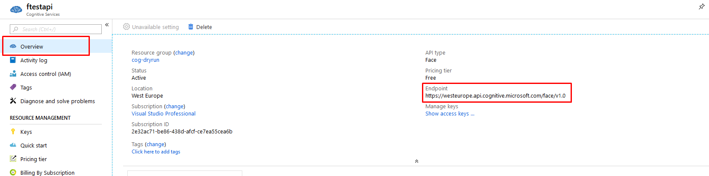
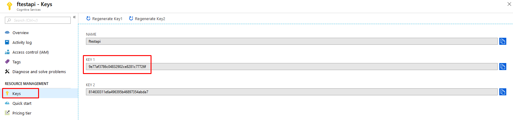
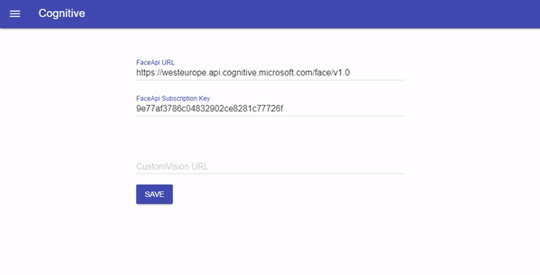

# Face Mask
## Settings
Get the `Endpoint` of the Face API that you created at [step 1 on README page](./README.md#prerequisites) by going to [Azure portal](https://portal.azure.com):

Get the `Key` of the Face app:

Add the `Endpoint` to `FaceApi URL` and the `Key` to `FaceApi Subscription Key` into the application as shown below then click on `Save`:

## Training
From the menu, navigate to `GDPR:Face train`:

Add data and train the model
1. Input or generate a `Group Id` then click on `Save & Use it`
2. Input a `Person Name` then click on `Add`
3. Choose a `Person` from the dropdown
4. Click on `Upload Photo(s)` and choose one or more photos with the selected person then wait for the photos to upload
5. Click on `Train` then wait for the model to be trained
6. Profit

## Test
From the menu, navigate to `GDPR:Face mask`. Click on `Choose Photo` and select a group photo that contains at least one person that you used for training. Wait for the application to mask the faces that are not trained.
You can use the `Download Result` button to download the final result