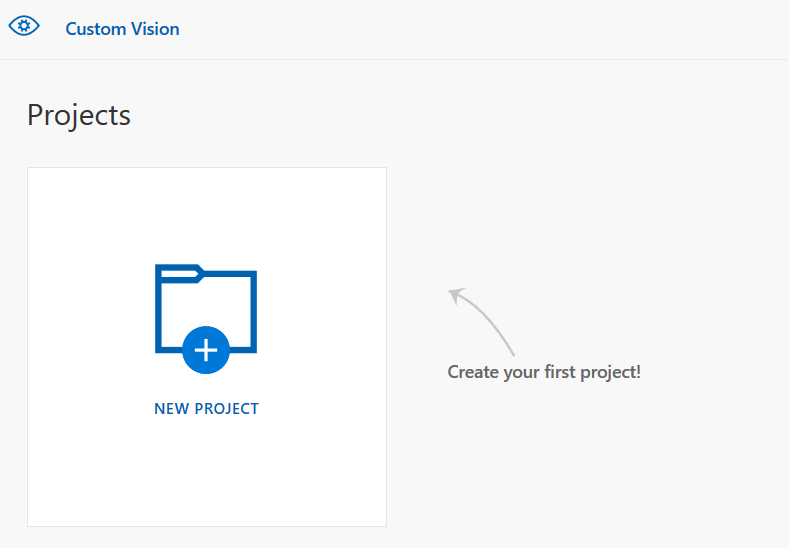
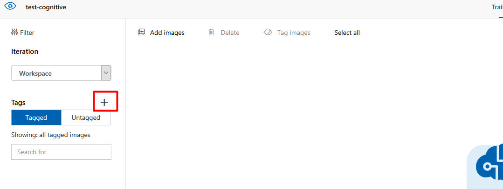
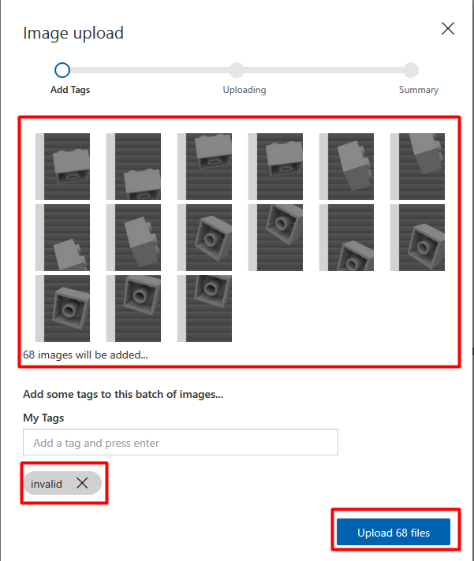
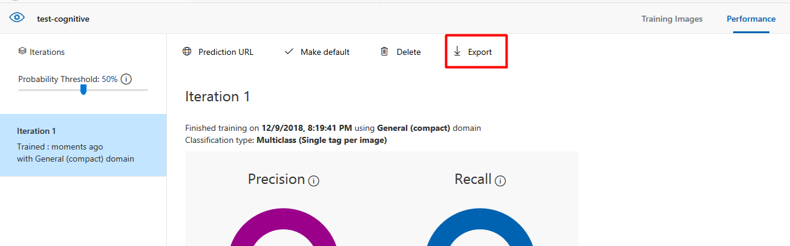
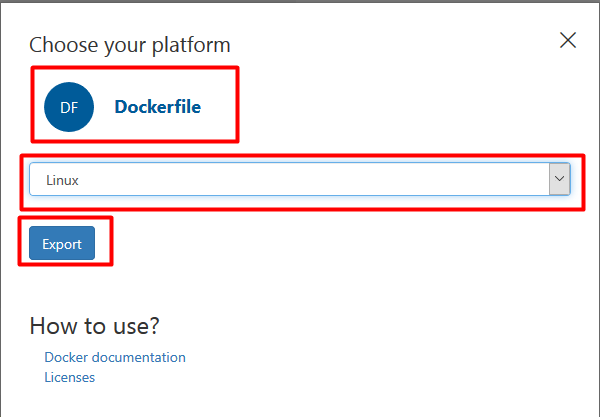

# Lego Conveyor
## Preparation
After you create a `Custom Vision` account in [Azure](https://portal.azure.com), follow the next steps:
1. Navigate to [Custom Vision portal](https://customvision.ai/) and sign in
2. Click on New Project



3. Input the required details in the form as explained below and click on `Create Project`:


- Name: use anything you want
- Resource Group: select the resource created at step 1
- Project Type: choose `Classification`
- Clasification Types: choose `Multiclass`
- Domains: choose `General (compact)`

4. From the right panel, create two tags: `valid` and `invalid`



5. Use the images from [here](https://github.com/bibistroc/cognitive/raw/master/assets/lego-conveyor/training-data.zip) to upload `valid` and `invalid` pictures



6. After you uploaded the traing images for both tags, click on `Train` to train the model
7. After the model has been trained, click on `Export`



8. Choose the following for the export and click on `Export`:



- Platform: `Dockerfile`
- Version: `Linux`

9. Wait for the export to be ready then click on `Download` to download the required files
10. Unzip the files to a location on local computer and run the following commands inside that directory:

```sh
docker build -t cognitive-img .
docker run -d -p 80:80 --name cognitive cognitive-img
```

## Config
From the `Cognitive DEMO` application, navigate to settings and put the url of the docker container into `Custom Vision URL` input and click on `Save`.

P.S. Use `http://localhost/image` if you have local docker or use `http://<ip_of_docker_machine>/image` if you use docker-machine

## Test
From the menu, navigate to `Lego:Conveyor Belt`. Click on the play button to start the video and what it as it stops when an "invalid" piece is on the conveyor belt.