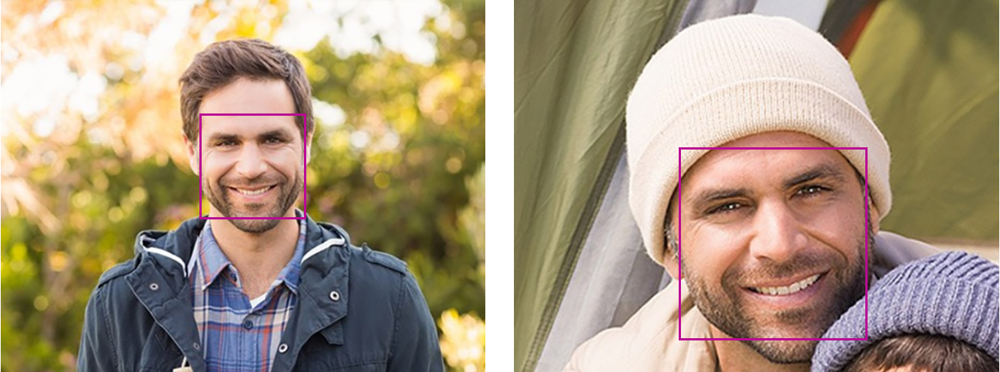
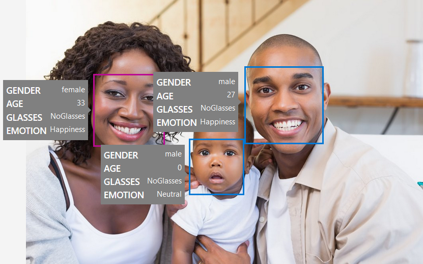
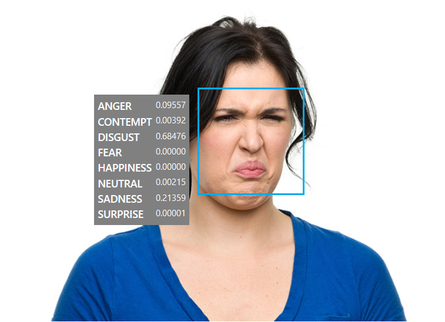
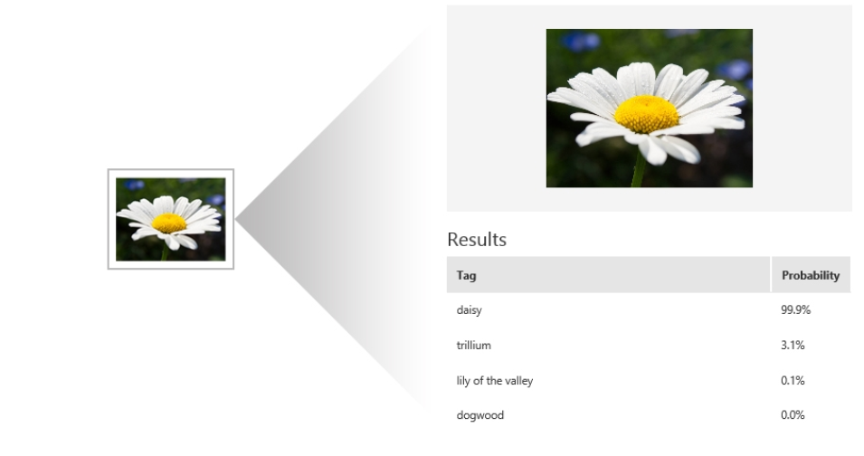

## Azure cognitive services
_... or AI without the hassle_ <!-- .element: class="fragment" -->
 
_... AKA for dummies_  <!-- .element: class="fragment" --> _like me..._ <!-- .element: class="fragment" -->


#### In order to demonstrate how easy it is to build something _inteligent_
I prepared a demo application in node using electron js <!-- .element: class="fragment" -->
_(because I am lazy)_ <!-- .element: class="fragment" -->


## What we will cover 
### Face API
_indentify person(s) of "interest" in a group photo_ <!-- .element: class="fragment" -->
### CustomVision
_indentify when a piece is misplaced on a conveyor belt_ <!-- .element: class="fragment" -->


## Face API
### What it can do


#### Face verification



#### Face detection



#### Emotion recognition



## What we will do
#### Use case
> We need to protect the identity of people that didn't give us permission to publish pictures with them both from public or private events


## Prerequisites
1. Create a FaceAPI account on azure <!-- .element: class="fragment" -->
2. Create a person group <!-- .element: class="fragment" -->
3. Create a person that we can identify <!-- .element: class="fragment" -->
4. Upload pictures of the person <!-- .element: class="fragment" -->
5. Train the model <!-- .element: class="fragment" -->


## Let's see how is done


## First we need to detect the faces ...
```javascript
const options = {
  method: 'POST',
  uri: 'https://westeurope.api.cognitive.microsoft.com/face/v1.0/detect',
  body: imageData,
  headers: {
    'Content-Type': 'application/octet-stream',
    'Ocp-Apim-Subscription-Key': subscriptionKey
  }
};
request(options).then((data) => {
  const facesData = JSON.parse(data);
  // ... process data and use it
});
```


## ... then we can identify them
```javascript
const options = {
  method: 'POST',
  uri: 'https://westeurope.api.cognitive.microsoft.com/face/v1.0/identify',
  body: {
    // face data, group id, maxNumOfCandidatesReturned & confidenceThreshold
  },
  headers: {
    'Content-Type': 'application/json',
    'Ocp-Apim-Subscription-Key': subscriptionKey
  }
};
request(options).then((personData) => {
  // ... process data and use it
});
```


## tl;dr
##### We have an URL for detecting the faces
```
https://[location].api.cognitive.microsoft.com/face/v1.0/detect
```
##### With some optional parameters
- returnFaceId _(optional)_
- returnFaceLandmarks _(optional)_
- returnFaceAttributes _(optional)_


##### And an URL for identify the faces
```
https://[location].api.cognitive.microsoft.com/face/v1.0/identify
```
##### With some parameters
- faceIds _(mandatory)_
- personGroupId _(mandatory)_
- maxNumOfCandidatesReturned _(optional)_
- confidenceThreshold _(optional)_


## Let's see it in action
# Demo time !! <!-- .element: class="fragment" -->


## Custom Vision
### What it can do


#### Classification & Object detection



## How it works


### 1. Upload Images 
_Upload your own labeled images, or use Custom Vision Service to quickly tag any unlabeled images._


### 2. Train
_Use your labeled images to teach Custom Vision Service the concepts you want it to learn._


### Profit: Evaluate
_Use simple REST API calls to quickly tag images with your new custom computer vision model, or simply export the model to device to run real-time image understanding._


### Bonus: Active learning
_Images evaluated through your custom vision model become part of a feedback loop you can use to keep improving your classifier._


## What we will do
#### Use case
> We need to detect when a piece is misplaced on a conveyor belt and stop the belt to avoid breaking the packaging


## Prerequisites
1. Create a Custom Vision account on azure <!-- .element: class="fragment" data-fragment-index="1" -->
2. Create a project on <!-- .element: class="fragment" data-fragment-index="2" --> https://customvision.ai/ <!-- .element: class="fragment" data-fragment-index="2" -->
3. Create valid and invalid tags <!-- .element: class="fragment" data-fragment-index="3" -->
4. Add photos for each tag (minimum 15) <!-- .element: class="fragment" data-fragment-index="4" -->
5. Train the model <!-- .element: class="fragment" data-fragment-index="5" -->


## Let's see how is done


#### First we capture frames from the video on a canvas ...
_(because javascript...)_
```javascript
displayFrame: () => {
  canvasContext.clearRect(0, 0, canvasWidth, canvasHeight);
  // ... detect video frame ration and scale it to fit the canvas
  // returning the renderableWidth and renderableHeight
  
  canvasContext.drawImage(videoContext, 0, 0, renderableWidth, renderableHeight);
  
  // recall this method again when a new frame is received
  window.requestAnimationFrame(displayFrame);
}
```


#### ... then we classify the image
```javascript
const options = {
  method: 'POST',
  uri: 'http://localhost/image',
  body: imageData,
  headers: {
      'Content-Type': 'application/octet-stream'
  }
};
request(options).then((predictData) => {
  // ... process data and use it
}); 
```


## tl;dr
#### We have some code to extract frames from the video
#### For each "x" frame we make a call with the image data into the body to get the tags
```
http://localhost/image - for exported docker container
- OR -
http://[location].api.cognitive.microsoft.com/customvision/v1.0/
prediction/[project]/image?iterationId=[iteration]
```


## Let's see it in action
# Demo time !! <!-- .element: class="fragment" -->